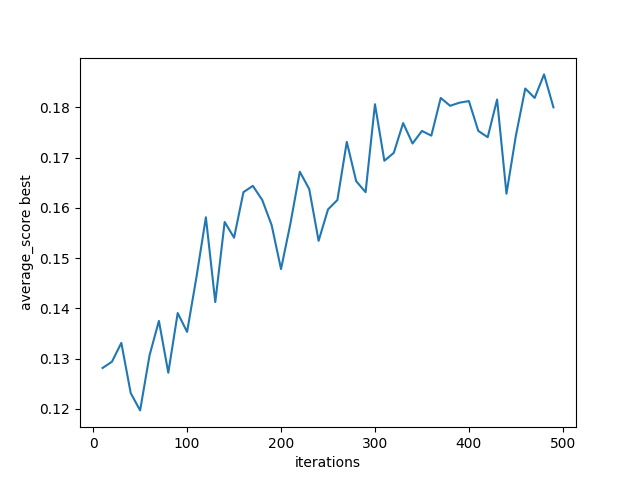
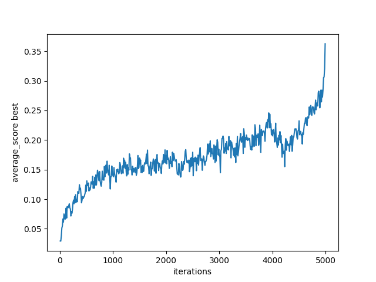

self.evaluate -> changement de la version 4 à 5 -> on evalue plus tt le temps l'individu


```python
print(i1.convert(12,True,2)) #12 
print(i1.convert(13,False,3)) #21
print(i1.convert(17,False,5)) #63
 

```
fonction post patch :

```python	

def croupier_converter(self,valeur:int):
        if valeur==1:
            return 9
        else:
            return valeur-2
    
def convert(self,valeur:int,h_as:bool,valeur_croupier:int):
        """ Renvoie l'indice du chromosome associé à une valeur"""
        i=self.croupier_converter(valeur_croupier) # 2-> 0 | 3->1 | 1->9 
        if h_as :
            if valeur >=10 and valeur<18:
                return i*19+valeur
            else:
                return i*19+18
        
            
            
        else:
            if valeur>=2 and valeur<12:
                return i*19
            else:
                return i*19+valeur-11
```	

patch effetcue aussi sur la fonction play 

debug : 
```python
print('\n')
print('value:',self.calculate_val(player_list))
print('choice:',choice)
print('c_list 0 :',croupier_list[0])
print('As ?',(1 in player_list))
print('p_list:',player_list)

```

Code avec selection roulette wheel :

```python

import random 
import numpy as np
import matplotlib.pyplot as plt
import sys


sys.setrecursionlimit(100000) #pour éviter les erreurs de récursion

PRECISION = 20
NB_ITERATIONS=2000
NB_INDIVIDUS=32 #multiple de 32
CROUPIER_MAIN=2 #valeur de la main du croupier à observer

test_graph_x=[]
test_graph_y=[]

class Individu():
    def __init__(self) -> None:
        self.chromosomes = [0 for _ in range(190)]
        self.fitness=0
    
    
    
    def __str__(self) -> str:
        """Affichage un peu esthétique"""
        i=self.croupier_converter(CROUPIER_MAIN)

        return f"""        ---------------------------[ Croupier {CROUPIER_MAIN}--------------------------------- \n
        Sans as : [2-11]| [12]| [13]| [14]| [15]| [16]| [17]| [18]| [19]| [20]\n
                  [{self.chromosomes[i*19]}]   | [{self.chromosomes[i*19+1]}] | [{self.chromosomes[i*19+2]}] | [{self.chromosomes[i*19+3]}] | [{self.chromosomes[i*19+4]}] | [{self.chromosomes[i*19+5]}] | [{self.chromosomes[i*19+6]}] | [{self.chromosomes[i*19+7]}] | [{self.chromosomes[i*19+8]}] | [{self.chromosomes[i*19+9]}]\n
        ----------------------------------------------------------------------
        \n        Avec as : [10]| [11]| [12]| [13]| [14]| [15]| [16]| [17]| [18-20]
        \n                  [{self.chromosomes[i*19+10]}] | [{self.chromosomes[i*19+11]}] | [{self.chromosomes[i*19+12]}] | [{self.chromosomes[i*19+13]}] | [{self.chromosomes[i*19+14]}] | [{self.chromosomes[i*19+15]}] | [{self.chromosomes[i*19+16]}] | [{self.chromosomes[i*19+17]}] | [{self.chromosomes[i*19+18]}]
        \n        ----------------------------------------------------------------------"""

    def croupier_converter(self,valeur:int):
        if valeur==1:
            return 9
        else:
            return valeur-2
    
    def random_init(self):
        for i in range(190):
            self.chromosomes[i] = random.randint(0, 1)
    
    def convert(self,valeur:int,h_as:bool,valeur_croupier:int):
        """ Renvoie l'indice du chromosome associé à une valeur"""
        i=self.croupier_converter(valeur_croupier) # 2-> 0 | 3->1 | 1->9 
        if h_as :
            if valeur >=10 and valeur<18:
                return i*19+valeur
            else:
                return i*19+18
        
            
            
        else:
            if valeur>=2 and valeur<12:
                return i*19
            else:
                return i*19+valeur-11
    
    def calculate_val(self,tab:list):
        total=0
        for card in tab:
            if card==1:
                if total+10<=21:
                    total+=10
                else:
                    total+=1
                    tab.remove(1)
                    #retirer l'as pour qu'il ne soit plus compté
                    tab.append(2)
                    tab.append(-1)
            else:
                total+=card
        return total
    
    def play(self):
        """Joue un 1v1 contre le croupier en fonction de ses chromosomes et voit si il gagne"""
        in_game=True
        p_in_game=True
        c_in_game=True
        winner=False
        player_list=[np.random.choice(np.arange(1, 11), p=( #renvoie une valeur de 1/10 pondérée
                    [1/13 for _ in range(9)]+[4/13]))]
        croupier_list=[np.random.choice(np.arange(1, 11), p=(
                    [1/13 for _ in range(9)]+[4/13]))]
        while in_game:
            

            choice=self.convert(self.calculate_val(player_list),(1 in player_list),croupier_list[0])
           
            
            if self.chromosomes[choice]==1 and p_in_game:
                   player_list.append(np.random.choice(np.arange(1, 11), p=(
                    [1/13 for _ in range(9)]+[4/13])))
            else:
                p_in_game=False
            
            if self.calculate_val(croupier_list)<17 and c_in_game:
                croupier_list.append(np.random.choice(np.arange(1, 11), p=(
                    [1/13 for _ in range(9)]+[4/13])))
            else:
                c_in_game=False
            
            if not p_in_game and not c_in_game:
                in_game=False
                if self.calculate_val(player_list)<21 and self.calculate_val(player_list)>self.calculate_val(croupier_list):
                    winner=True
            elif self.calculate_val(player_list)>21:
                winner=False
                in_game=False
            elif self.calculate_val(player_list)==21:
                winner=True
                in_game=False
        
    
        return winner
    

    def evaluate(self):
        """evalue le chromosome et retourne une valeur numerique"""
        count=0
        for _ in range(PRECISION):
            if self.play():
                count+=1
            
        self.fitness= count/PRECISION
    

def mutation(i1: Individu):
    """Mutation d'un individu -> 1 bit aléatoire"""
    index1 = random.randint(0, 188)
    i1_p = i1
    i1_p.chromosomes[index1] = 1-i1.chromosomes[index1]
    i1_p.evaluate()
    if i1_p.fitness<i1.fitness: #garde le meilleur
        i1_p=i1
    return i1_p    
                                  

def croisement(i1: Individu, i2: Individu):
    """Croisement de deux individus -> découpe en 2 sous-chaines pour l'instant"""
    i3 = Individu()
    i4=Individu()
    
    index1 = random.randint(0, 188)
    index2 = random.randint(0, 188)
    
    i3.chromosomes = i1.chromosomes[:index1] + i2.chromosomes[index1:]
    i4.chromosomes = i1.chromosomes[:index2] + i2.chromosomes[index2:]
    i3.evaluate()
    i4.evaluate()
    if i3.fitness<i1.fitness: #garde le meilleur
        i3=i1
    if i4.fitness<i2.fitness:
        i4=i2
    return i3,i4

def find(liste,val):
    for elem in liste:
        if elem[2]>=val and elem[1]<=val:
            return elem[0]


def generation(list_individus,gen_nb):
    
    if gen_nb==NB_ITERATIONS:
        
        for individu in list_individus:
            individu.evaluate()
        
        list_individus.sort(key=lambda x: x.fitness)
        for individu in list_individus:
            print(f'evaluate : {individu.fitness}\n{individu}\n') #plus forcement le meme evaluate qu'avant (random) donc le meme sens
    else:
        list_conserv=[]
        for _ in range(NB_INDIVIDUS//2):
            """ moitié est conservée"""
            list_conserv.append(list_individus[0])
            list_individus.pop(0) 

        for _ in range(NB_INDIVIDUS//4):
            """ un quart est muté"""
            list_conserv.append(mutation(list_individus[0]))
            list_individus.pop(0)
        
        for _ in range(NB_INDIVIDUS//8):
            """ un quart est croisé"""
            i1,i2=croisement(list_individus[0],list_individus[NB_INDIVIDUS//8])
            i1.evaluate()
            i2.evaluate()
            list_conserv.append(i1)
            list_conserv.append(i2)
            list_conserv.pop(0)
            list_conserv.pop(NB_INDIVIDUS//8)
        
        ### Roulette wheel selection
        score=0
        association=[]

        for id in list_conserv:
            debut=score
            score+=id.fitness
            fin=score
            association.append((id,debut,fin))
        
        liste_finale=[]

        for _ in range(NB_INDIVIDUS):
            a=random.uniform(0,1)
            liste_finale.append(find(association,a*score))
        ###


        if gen_nb%10==0:
            test_graph_x.append(gen_nb)
            test_graph_y.append(score)
        
        print(f'Generation : {gen_nb} | score : {score}')
        generation(liste_finale,gen_nb+1)

def generate():
    list_individus=[]
    for _ in range(NB_INDIVIDUS):
        i1=Individu()
        i1.random_init()
        i1.evaluate()
        list_individus.append(i1)
    generation(list_individus,1)

generate()

plt.plot(test_graph_x, test_graph_y)
plt.xlabel('iterations')
plt.ylabel('average_score best')
plt.show()


```

Stochastic remainder without replacement selection:
```python

liste_finale=[]
score=0
moy_fitness=sum([individu.fitness for individu in list_conserv])/NB_INDIVIDUS

for id in list_conserv:
    r_i=id.fitness/moy_fitness
    a=floor(r_i)
    for _ in range(a):  
        liste_finale.append(id)
            
        
association=[]
for id in list_conserv:
    debut=score
    score+=(id.fitness/moy_fitness)-floor(id.fitness/moy_fitness)
    fin=score
    association.append((id,debut,fin))
        
for _ in range(NB_INDIVIDUS-len(liste_finale)):
    a=random.uniform(0,1)
    liste_finale.append(find(association,a*score))


```

 

-> probleme : on stagne à 0.2 à 1500 iterations environs -> puis suraprentissage
pour eviter ca jvais faire un scaling exponentiel -> avoir une population moins homogene

Image de la fonction de scaling en fonction du nb d'iteration 


Apres le scaling :

 
Resultats sans scaling à environ 0.22 de score ( 5000 iterations - 16 individus - P=0.1)
Soit une partie gagnée sur 5 -> encore du progres à faire
-> jvais modifier p pour voir les changements + nb iterations 

Valeurs à test : p=0.2 et 3000 iterations
p=0.05 et 5000 iterations

CHANGEMENT optimisation -> nouvelle fonction random 
 fini numpy

 ```python	
 PROBA_ARRAY=[1,2,3,4,5,6,7,8,9,10,10,10,10]
 random.choice(PROBA_ARRAY)
 ```


 meilleur resultats avec un score de 0.23 avec ces parametres :


 ```python
PRECISION = 30
NB_ITERATIONS=20000
NB_INDIVIDUS=32 #multiple de 32
CROUPIER_MAIN=2
P=0.08
 
 ```	

 -> g obtenu un 0.43 avec ces parametres

  ```python
 PRECISION = 30
NB_ITERATIONS=50000
NB_INDIVIDUS=64 #multiple de 32
CROUPIER_MAIN=2 #valeur de la main du croupier à observer
P=0.08 #valeur pour le scaling
```

On va implementer du sharing de base-> permettre de repartir mieux les individus
On va d'abord définir une distance 

distance classique : 

$$\sqrt{\sum_{k=1}^{N}(t_{1,k}-t_{2,k})²}$$

Le sharing classique n'est pas vivable -> rajoue (N^2) calculs à chaque generation 
-> on va faire du sharing clusterise

le code :

```python

def distance(i1: Individu, i2: Individu):
    """Distance entre deux individus"""
    return sqrt(sum([(i1.chromosomes[i] - i2.chromosomes[i])**2 for i in range(190)]))

def sharing_s(i1: Individu, i2: Individu):
    """Fonction somme du sharing """
    d = distance(i1, i2)
    if d < sigma_sharing:
        return 1 - (d/sigma_sharing)**alpha_sharing
    else:
        return 0


def sharing(i1:Individu, list_individus:list):
    """Fonction de Sharing"""
    return sum([sharing_s(i1, i2) for i2 in list_individus])

##########################
#PASS
##########################

liste_finale=[]
        score=0
        k_exp=exp_scaling(gen_nb)
        total=0
        for individus in list_conserv:
            liste_conserv_without_elem=[elem for elem in list_conserv if elem!=individus]
            s=sharing(individus,liste_conserv_without_elem)
            if s!=0:
                total+=((individus.fitness)**k_exp)/sharing(individus,liste_conserv_without_elem)
            else:
                total+=((individus.fitness)**k_exp)


        moy_fitness=total/NB_INDIVIDUS

        for id in list_conserv:
            s=sharing(individus,liste_conserv_without_elem)
            if s!=0:
                r_i=(((id.fitness)**k_exp)/s)/moy_fitness
            else:
                r_i=(((id.fitness)**k_exp))/moy_fitness
            a=floor(r_i)
            for _ in range(a):  
                liste_finale.append(id)
            
        
        association=[]
        for id in list_conserv:
            debut=score
            s=sharing(individus,liste_conserv_without_elem)
            if s!=0:
                score+=(((id.fitness)**k_exp)/s)/moy_fitness-floor((((id.fitness)**k_exp)/s)/moy_fitness)
            else:
                score+=(((id.fitness)**k_exp))/moy_fitness-floor((((id.fitness)**k_exp))/moy_fitness)
            fin=score
            association.append((id,debut,fin))
        
        for _ in range(NB_INDIVIDUS-len(liste_finale)):
            a=random.uniform(0,1)
            liste_finale.append(find(association,a*score))


```